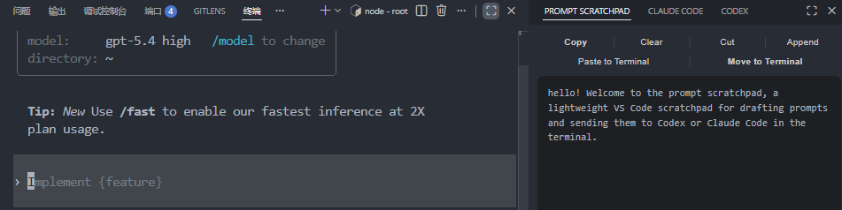
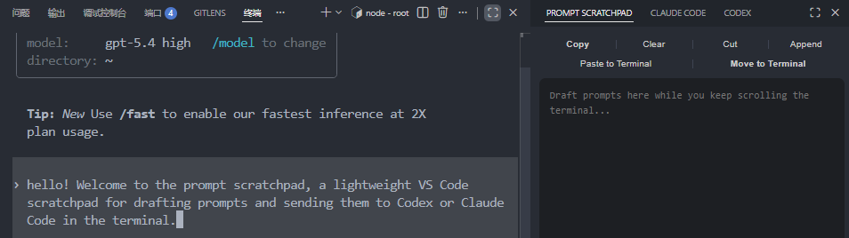

# Prompt Scratchpad

Prompt Scratchpad is a lightweight VS Code companion for terminal-based coding agents such as Codex and Claude Code.

It gives you a dedicated drafting space inside VS Code, so you can keep reading terminal output while preparing the next prompt, then paste or move that draft back into the active terminal when you are ready.

## Why Prompt Scratchpad

Terminal-first AI workflows are powerful, but they have an annoying ergonomics problem: the same terminal is often used for both long model output and the next prompt.

That creates friction:

- you scroll up to read
- you scroll back down to type
- you lose your place
- you repeat the cycle

Prompt Scratchpad removes that friction with a simple idea:

- draft outside the terminal
- keep the terminal visible
- send the draft back only when it is ready

It stays intentionally focused. Prompt Scratchpad does not try to replace your terminal workflow. It just makes that workflow smoother.

## What it does

- Opens from a compact status bar entry: `PS`
- Provides a persistent scratchpad inside VS Code
- Supports three open locations:
  - sidebar
  - panel
  - editor
- Keeps one shared draft across all three presentations
- Includes text actions:
  - `Copy`
  - `Clear`
  - `Cut`
  - `Paste`
- Includes terminal actions:
  - `Paste to Terminal`
  - `Move to Terminal`
- Persists the draft across reloads
- Sends text to the active terminal without pressing Enter
- Warns if no active terminal is available

## Typical workflow

1. Open Prompt Scratchpad from the status bar.
2. Draft the next prompt while keeping terminal output visible.
3. Use:
   - `Paste to Terminal` to send the draft without clearing it
   - `Move to Terminal` to send the draft and clear the scratchpad

`Move to Terminal` is especially useful when the scratchpad is acting as a temporary staging area for repeated CLI prompts.

## Screenshots

Draft the next prompt while keeping your terminal context in view:



Move the draft back into the active terminal when it is ready:



## Configuration

### `promptScratchpad.openLocation`

Controls where the status bar action opens the scratchpad.

Available values:

- `sidebar`
- `panel`
- `editor`

Default:

```json
{
  "promptScratchpad.openLocation": "sidebar"
}
```

## Installation

Prompt Scratchpad can be installed directly from the GitHub release artifact.

### Download from GitHub Releases

Download the latest `.vsix` from:

- [Releases](https://github.com/xukp20/prompt-scratchpad/releases)

### Install from VSIX in VS Code

1. Open the Extensions view in VS Code
2. Select `...` in the top-right corner
3. Choose `Install from VSIX...`
4. Select your packaged `.vsix` file

### Install from the command line

```bash
code --install-extension prompt-scratchpad-0.0.2.vsix
```

If you are using VS Code Insiders:

```bash
code-insiders --install-extension prompt-scratchpad-0.0.2.vsix
```

## Local development install

You can also build and install Prompt Scratchpad locally without publishing it anywhere.

### Build a new VSIX

```bash
npx vsce package
```

## Commands

- `Prompt Scratchpad: Open Scratchpad`
- `Prompt Scratchpad: Open in Sidebar`
- `Prompt Scratchpad: Open in Panel`
- `Prompt Scratchpad: Open in Editor`

## Development

```bash
npm install
npm run compile
```

Press `F5` in VS Code to launch an Extension Development Host.

## License

[MIT](./LICENSE)
